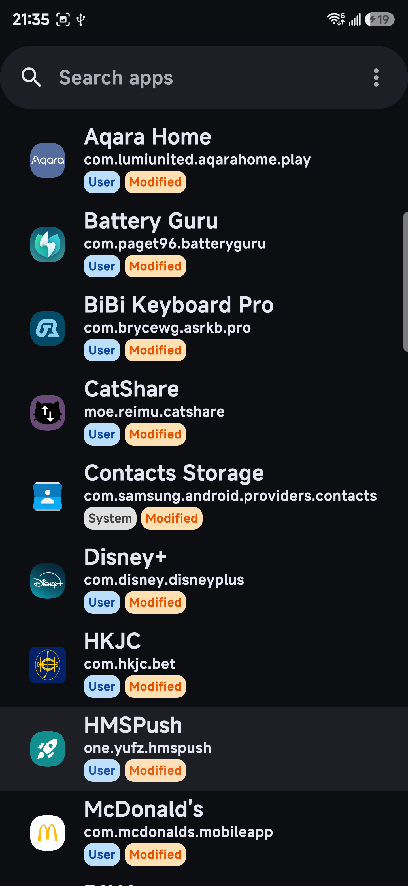
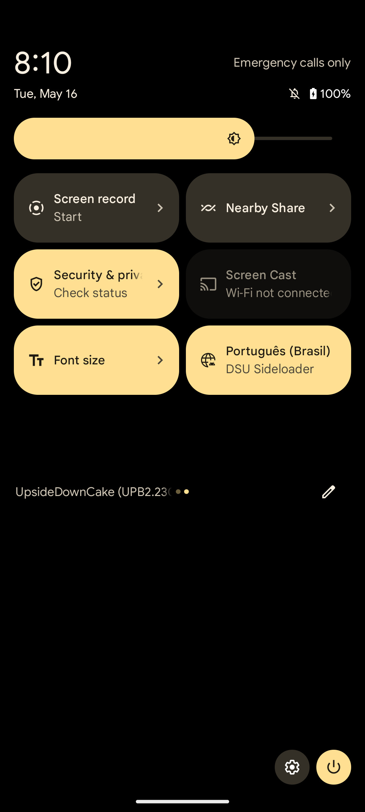

# 🌐 Language Selector Neo

**Change the language of individual Android apps without changing your whole system language.**

Language Selector Neo is useful on Android 13+ ROMs that still include Android's per-app language service, but do not provide a complete settings UI for it.

> Forked from [VegaBobo/Language-Selector](https://github.com/VegaBobo/Language-Selector), with a focus on speed, clarity, Traditional Chinese support, and safer automated dependency maintenance.
> 
> All code changes in this fork were vibe-coded with Codex.

  
  

## ✨ Highlights

| Area | What Neo improves |
| --- | --- |
| 🚀 Speed | Shows the basic app list first, then scans language status in the background. |
| 🔎 Search | Faster searching, with Enter submitting the query instead of adding a new line. |
| 🏷️ App status | Marks apps as `User`, `System`, or `Modified`. |
| 📌 Pinned languages | Long-press favorite languages to keep them at the top and reuse them in the QS tile. |
| 🧩 System apps | Show or hide system apps with a remembered toggle. |
| 🌏 Localization | Adds Traditional Chinese support. |
| 🔐 Maintenance | Uses Dependabot and GitHub Actions to keep dependencies and releases moving. |

## 🧰 What It Does

- Change the language of a specific app without changing the whole system language.
- Reset an app back to the system default language.
- Keep modified apps easy to find.
- Use a Quick Settings tile to cycle the current foreground app through pinned languages.

## ✅ Requirements

- Android 13 or newer.
- Shizuku installed, running, and granted to this app.
- Root may also be used on supported devices, but Shizuku is the normal recommended path.

Android 12 and older are not supported because the per-app language APIs this app uses were introduced with Android 13.

## 📦 Download

Get the latest APK from the [GitHub Releases](https://github.com/ezn24/Language-Selector/releases) page.

## 🚦 Quick Start

1. Install and start Shizuku.
2. Install Language Selector Neo.
3. Open the app and grant the Shizuku permission when prompted.
4. Select an app from the list.
5. Choose a language, or select system default to reset it.

> Language Selector Neo does **not** translate apps. It only asks Android to launch the selected app with a chosen locale. If the app does not include that language, it may keep showing its original language.

## ⚡ Quick Settings Tile

Pin one or more languages in the language picker, then add the Language Selector Neo tile from Android Quick Settings.

The tile cycles the current foreground app through your pinned languages. It does not change system apps, and it will be unavailable until at least one language is pinned.

## 📄 License

This fork follows the upstream project's license. See [LICENSE](LICENSE).
